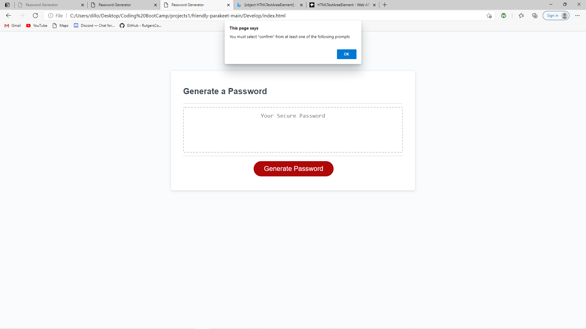
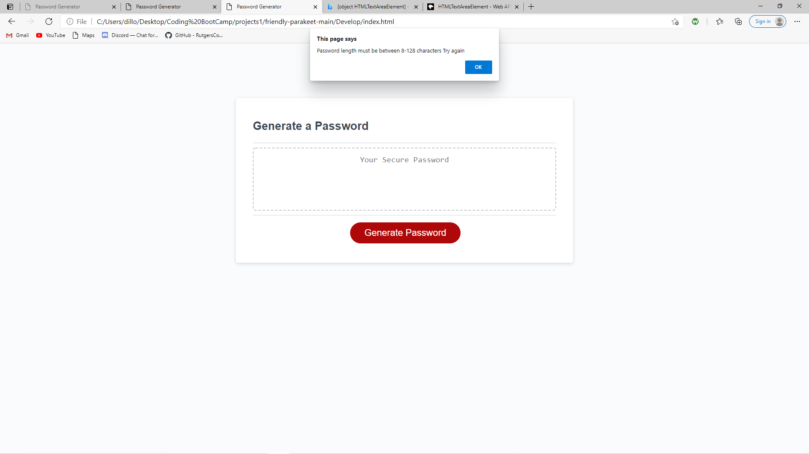
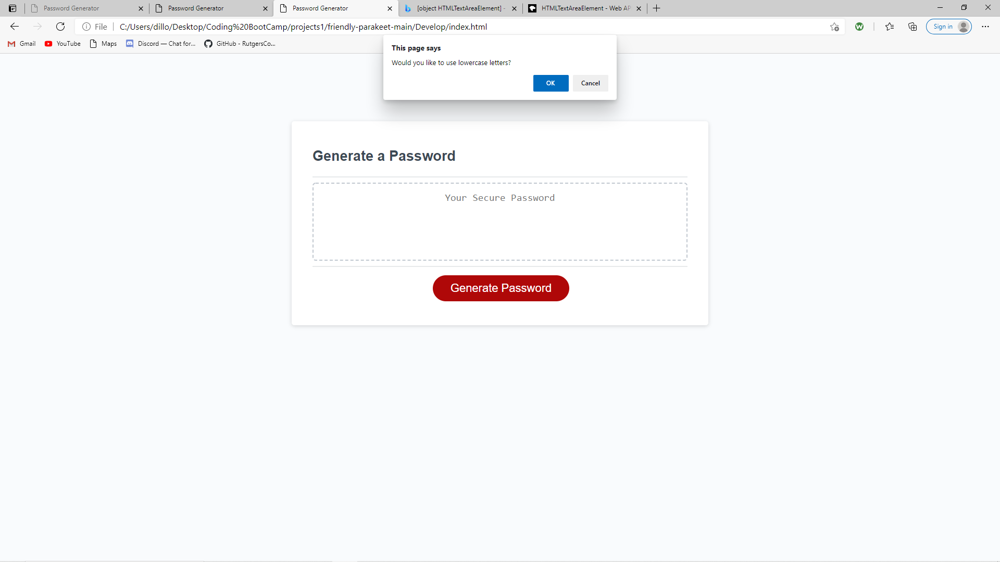
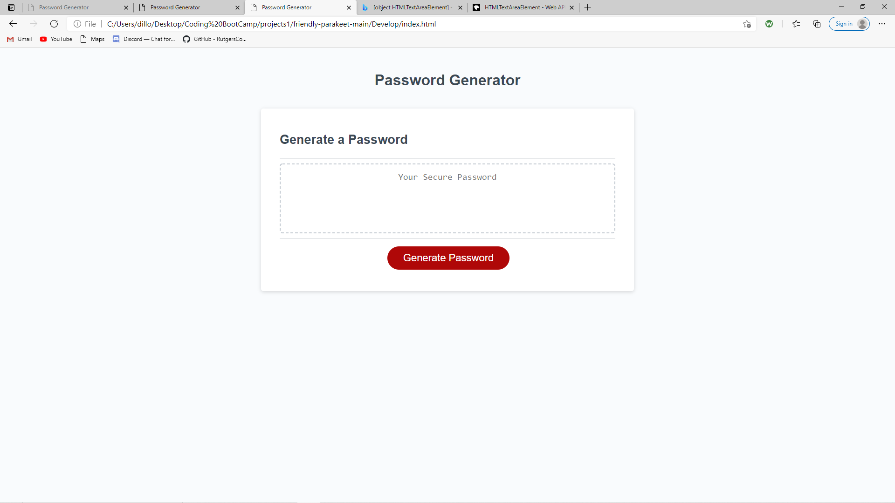

# Password Generator Starter Code

The goal for this assignment was to develop a random password generator that prompted users with several prompts to get a personalized secure password that is somewhere between 8 and 128 characters, contains at least 1 of the following, uppercase, lowercase, numbers or special characters. 

overall this project was successful I think there is definitely room for improvement, but overall the code works the way it was supposed to! 

Screenshot:

Live URL: https://dwalsh93.github.io/Zoomi/
